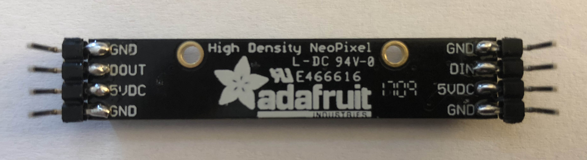
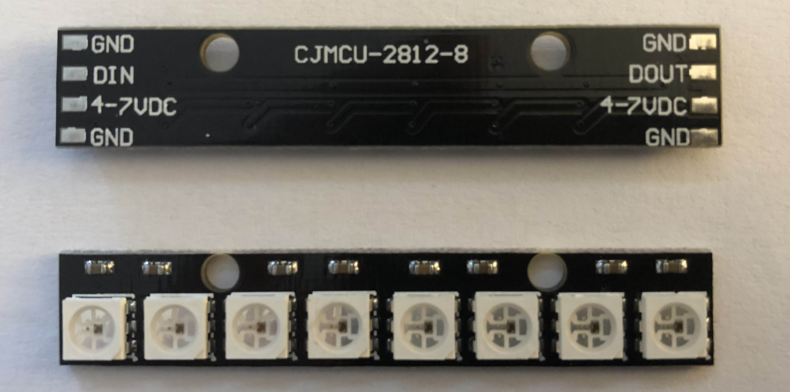
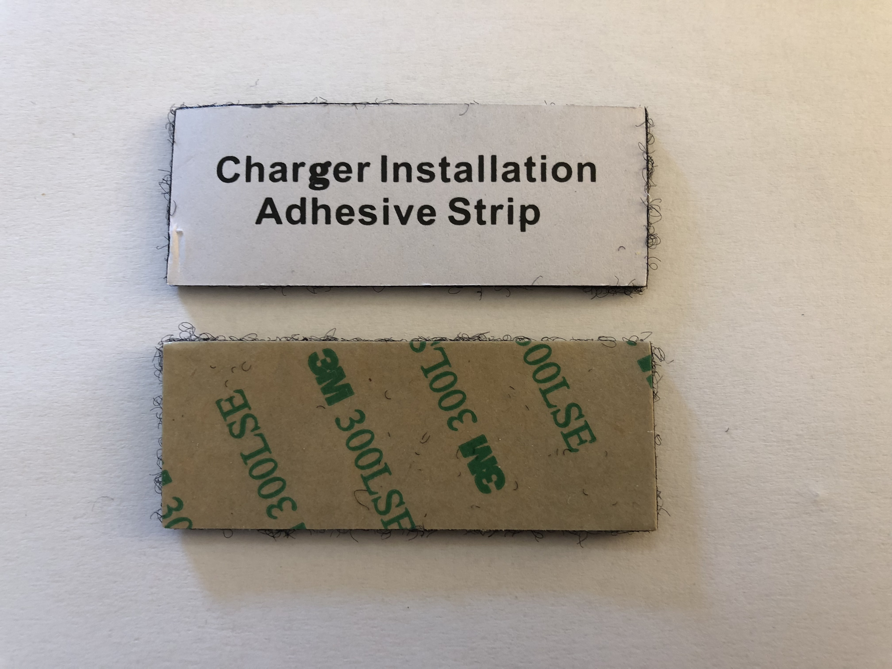
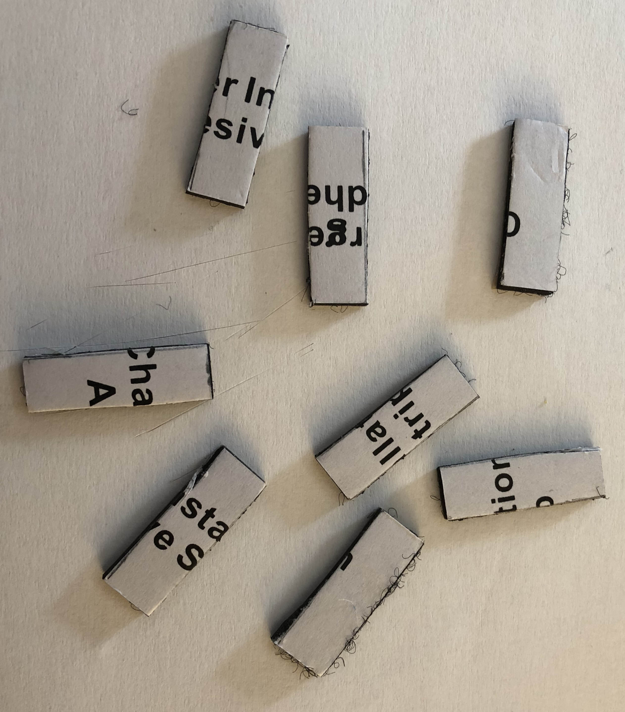
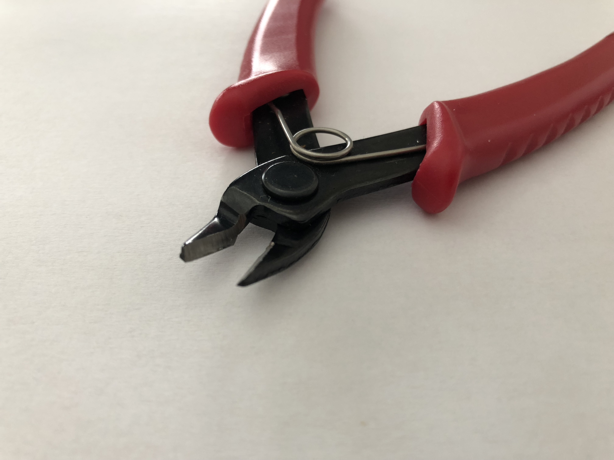
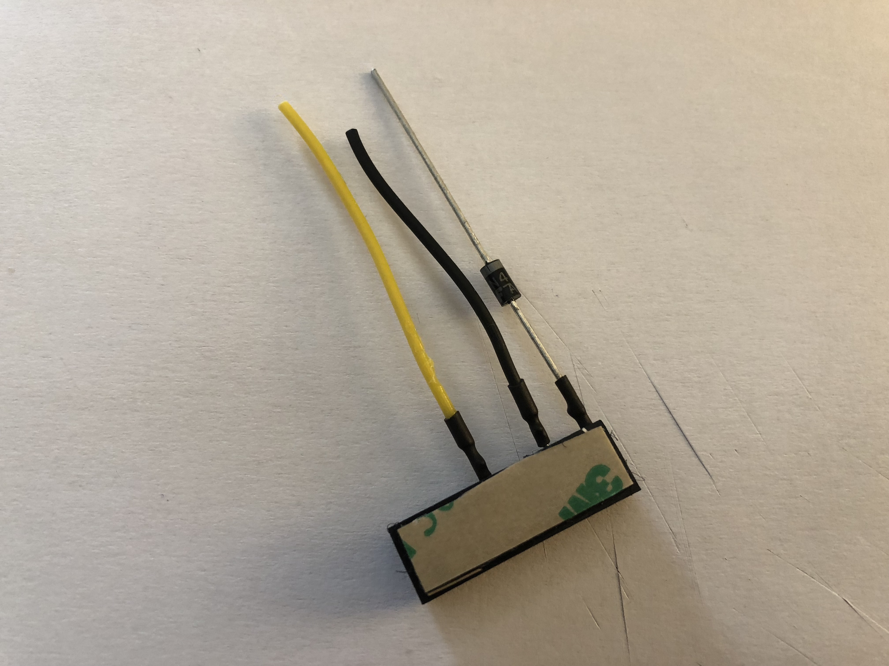
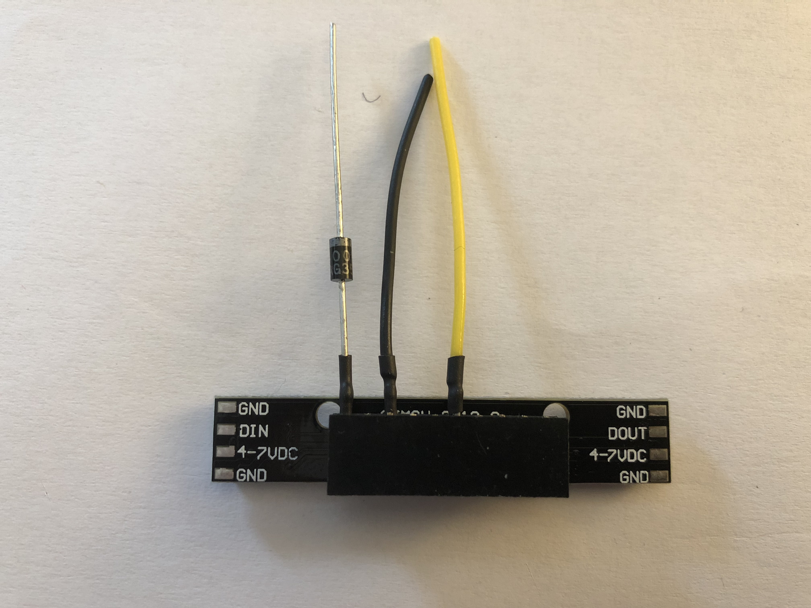
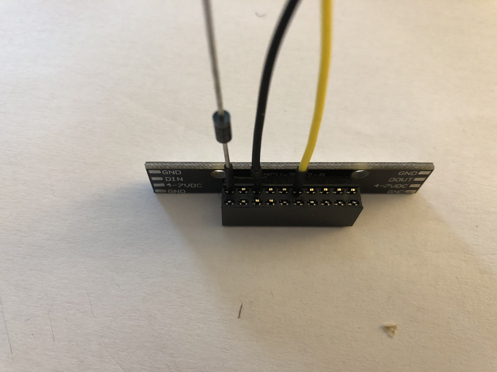
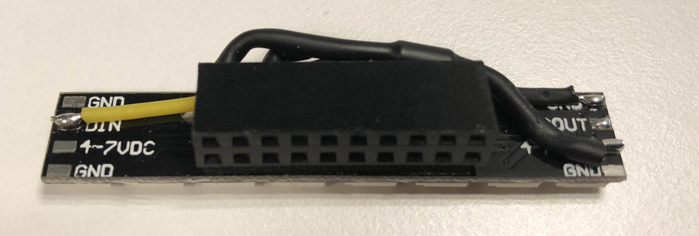

## LED Status indicator - assembly instructions

Following is a sequence of steps in the assembly of the LED status indicator.

### Required components and tools

The components needed to assemble the strip:

- 8 RGD LED strip (either an _Adafruit Neopixel strip_

OR

- a _8 kanaals WS2812 5050 RGB LED verlichting development board voor Arduino_

- Note that even though the above strips are functionally equivalent they are physically different in their connection pin layout.
- A 2 x 10 pin female header
- A 1N4001 diode
- Some double sided tape to glue the LED strip to the female header. If you buy the 10-port Anker USB power-hub, you will find that it comes with a piece of double sided foamy type of tape that is large enough to be cut in 5 pieces that can be used for this purpose:

- Some (thin) wire to connect the header pins to the LED strip. In total 3 connections need to be made. For the power connections (+5V to strip), the 1N4001 diode is long enough to make the connection without the need for extra wire.
- [Optionally] some shrink hoses; 2 sizes come in handy: [pre-shrunk] inside diameter 2mm and 3.5mm

As for tools, you will need:

- A soldering iron suited for soldering electronics + solder
- If you are going to use shrink hose, you need a heat source like a paint stripper that produces hot air warm enough to make the hose shrink. A hair dryer is not hot enough to do this. Don't use the paint stripper to dry your hair.
- An [electronics] wire-cutter like this one:

### Step-by-step assembly

- Trim all pins on the header that are not required. 3 pins will be left over
- Solder the 1N4001 diode to pin 1 on the female header
    - Note that a diode is asymmetrical. There's a white band on one side of the diode: it should "point away" from the header.
- Solder a piece of wire to pin 3 on the header (black on the pictures below)
- Solder another piece of wire to pin 6 on the header (yellow on the picture below)
- Use some thin (2mm) shrink to add insulation to the soldering joints - this is optional but prevents accidental short circuits and looks cool at the same time.

In pictures:

#### Female header with double-sided tape attached to it

#### Mounting direction of the 1N4001 diode

#### Header assembly - top view

#### Finished assembly (using the Arduino style strip)

Use some 3.5mm shrink hose to fully insulate the diode. Connect the diode and wires to the strip.

Following is a picture of a fully assembled strip.

### Fit the assembly on Pi

Missing a picture... In any case: with the side of the Pi board that has the 40-pin GPIO connecter on the near side, plug the assembly on the left side of the GPIO connector. Run exercise_000_initial_state to verify that your assembly actually works.
