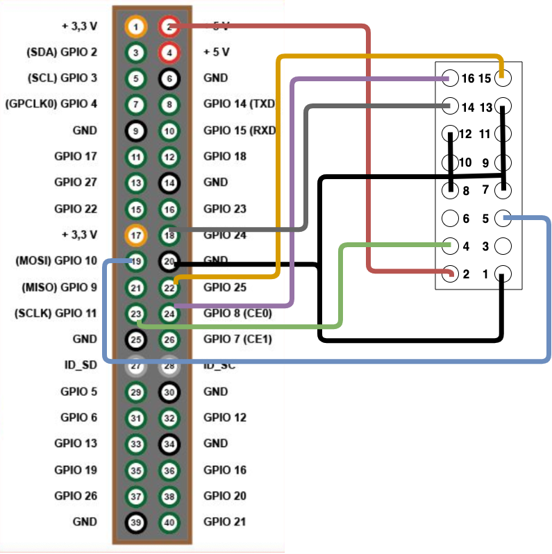
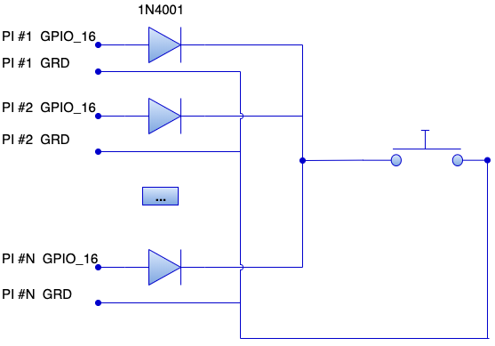

## Akka cluster with display - assembly instructions

There are several customization that you need to do with LED cluster.
- First we don't need LED and GPIO connector if it's custom
- You will need cluster case that is wider than standard rectangle one for example [this](https://www.amazon.com/Yahboom-Raspberry-Cluster-6-Layers-Enclosure/dp/B07K72STFB/ref=sr_1_7?crid=2O2A0WII28HLZ&keywords=raspberry+pi+case+cluster&qid=1576013537&sprefix=raspberry+pi+case+%2Caps%2C151&sr=8-7). 
The reason is that OLED monitor is wider than regular cluster case. 
- As long as display height is M3x33mm we'll need 35mm standoff [link](https://www.amazon.com/M3x35mm-Female-Thread-Hexagonal-Standoff/dp/B0799J75K5/ref=sr_1_6?keywords=Spacer+Standoff+35mm&qid=1576013395&sr=8-6)
- To build display panel you will need:
  - Acrylic sheet (3/4 inch), you need to cut rectangle piece to cover cluster case front side. You will need to drill holes to attache displays
  - Male-female spacer M2.5x10, M2.5 nuts and M2.5x6 screws to attach monitors to acrylic
  - Drill hole in acrylic beyond each monitor to push though connector cable with 2x8 socket

### Required components and tools for display panel

The components needed to assemble the strip:

You can purchase display [here](https://www.buydisplay.com/default/white-3-2-inch-arduino-raspberry-pi-oled-display-module-256x64-spi). 
It is graphical OLED 256x64 display with SPI support and it will be one display per Raspberry PI to display status

In order to make connector you need 
- 2x8 female header to connect display and 2x20 female header to connect to Raspberry PI 
- Double row right angle connector for display [link] (https://www.amazon.com/10PCS-40Pin-2-54mm-Right-Header/dp/B07VSC4PWW/ref=sr_1_2?keywords=double+Row+Right+Angle&qid=1575646161&s=electronics&sr=1-2)

Connection schema shown below:

You can use standard or Dupont connectors.

### Button assembly

In order to switch between screens we'll need some external tool like button

Button will be attached for all Raspberries and work despite home many of them are on
We should use the same 2x20 female header we used to connect display to each Raspberry

- Need to use membran button [link](https://www.amazon.com/Membrane-Switch-Keyboard-Keypad-40x20x0-8mm/dp/B071W3JF9J/ref=sr_1_15?keywords=MEMBRANE+BUTTON+SWITCH&qid=1575646686&sr=8-15) 
in order to stick it to the top side of cluster. 
- Also you will need 1N4001 diode
- 2 pin male header to connect all wires with button

Connection schema shown below:

