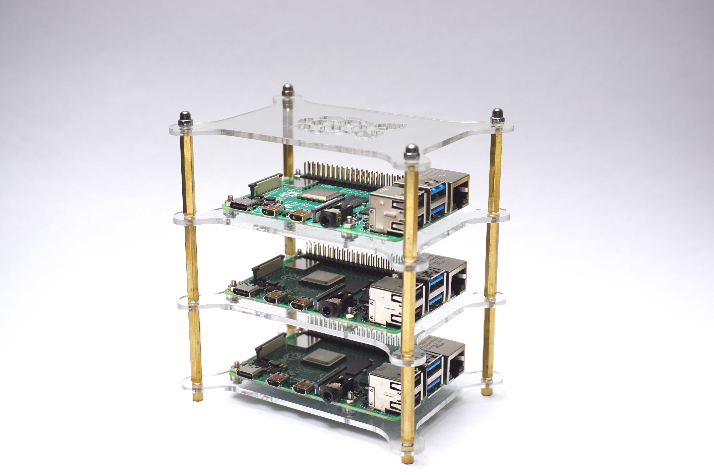
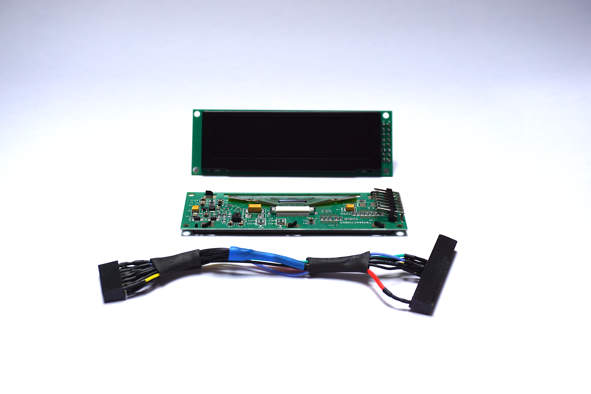
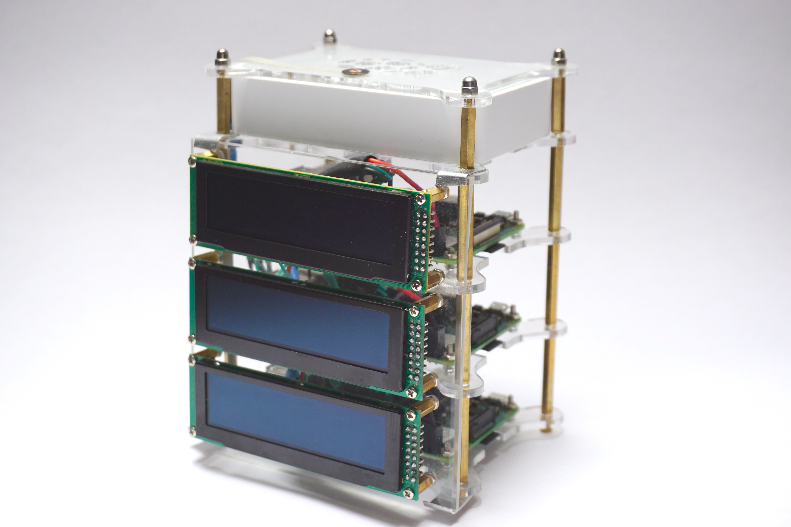

# Raspberry Pi Cluster with Displays

Along with LED string display cluster there is another version of assembly that is with OLED displays attached to each node.

You need to start from standard Raspberry Pi Cluster

Then you will add displays like:

And you will end up with cluster like following:

On the top there is ethernet switch and sensor button to switch between views (cluster, sharding etc)

First you need to assembly cluster with [instructions](display-assembly-instructions.md). Next step will be to prepare 
Linux images with proper configuration on SD and run nodes ([instructions](display-installation-instructions.md)) 
